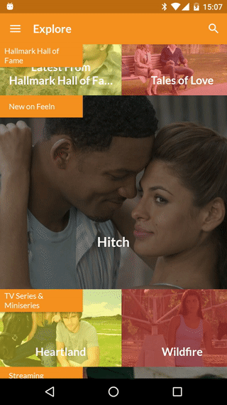

# LongTouch for Android (3D Touch for Android)


## Installation
    compile 'cz.kinst.jakub:longtouch:0.3'
    
## How to use
1. Create a `LongTouchHelper` instance in your Activity/Fragment/ViewModel
2. Protect scrollable elements underneath the target view from scrolling when long-touched using `protectTouchOnViews(View... views)` method
3. Enable popup window on target View using `addViewPopup(View target, ContentViewProvider contentViewProvider)` method

## Example
```java
LongTouchHelper helper = LongTouchHelper.setup((FrameLayout) findViewById(R.id.root));
helper.protectTouchOnViews(findViewById(R.id.scroll_view));
helper.addViewPopup(findViewById(R.id.target), new LongTouchHelper.ContentViewProvider() {
	@Override
	public View getPopupContentView() {
		return LayoutInflater.from(MainActivity.this).inflate(R.layout.popup_hello, null);
	}
});
```

## API
- `addViewPopup(View target, ContentViewProvider contentViewProvider)`
- `removeViewPopup(View target)`
- `protectTouchOnViews(View... views)`
- `setLongPressDelay(int delay)`
- `setRevealEffectEnabled(boolean enabled)`
- `setPopupAnimationProvider(PopupAnimationProvider animationProvider)`
- `setHapticFeedbackEnabled(boolean enabled)`
- `setBlurEnabled(boolean enabled)`
- `setBlurRadius(int enabled)` (radius: 0-25)

## License
    Copyright 2015 Jakub Kinst & Adam Smolik & Stepan Sanda
    
    Licensed under the Apache License, Version 2.0 (the "License");
    you may not use this file except in compliance with the License.
    You may obtain a copy of the License at
    
      http://www.apache.org/licenses/LICENSE-2.0
    
    Unless required by applicable law or agreed to in writing, software
    distributed under the License is distributed on an "AS IS" BASIS,
    WITHOUT WARRANTIES OR CONDITIONS OF ANY KIND, either express or implied.
    See the License for the specific language governing permissions and
    limitations under the License.
